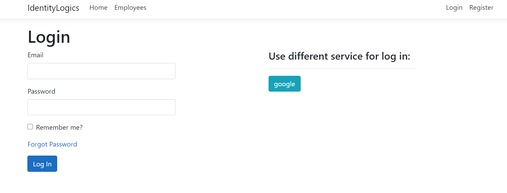
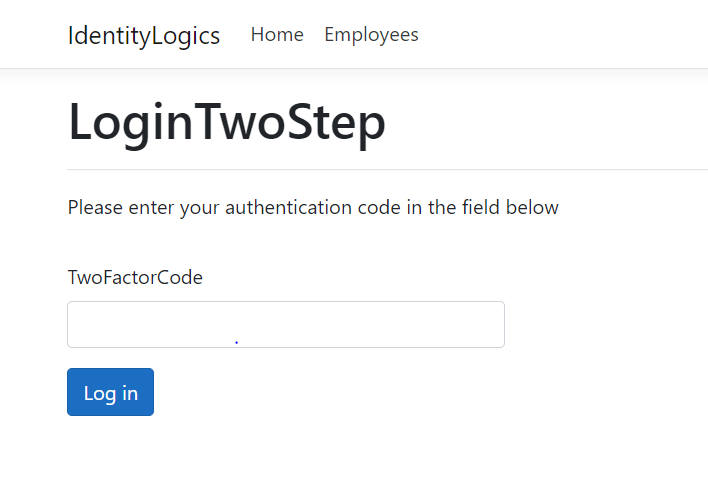
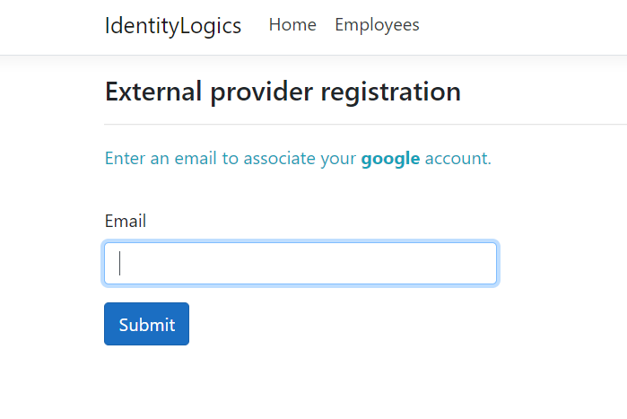
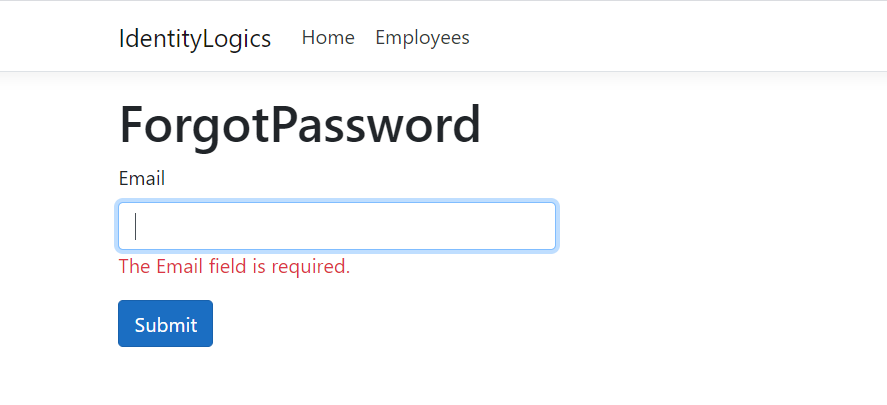
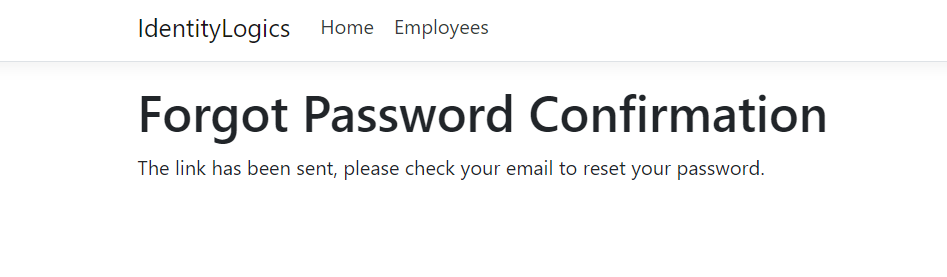
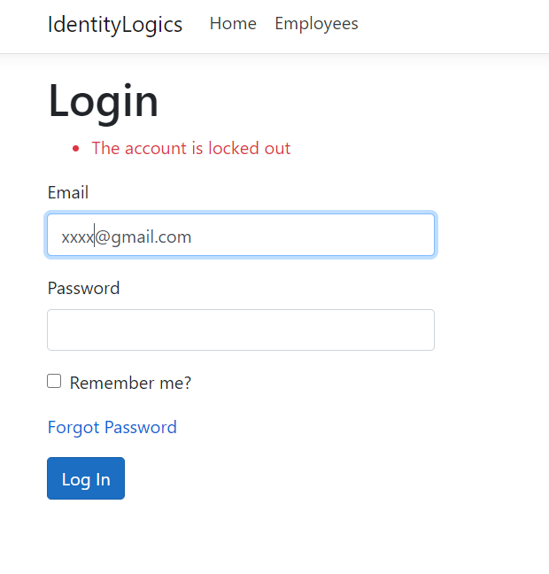
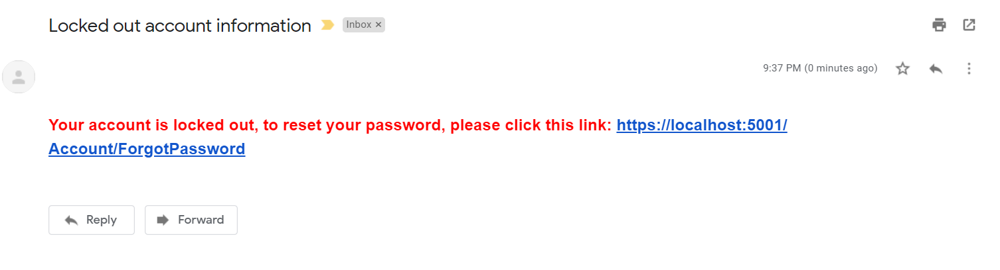
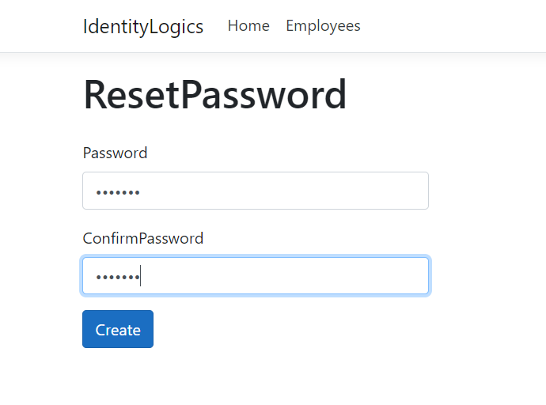

# IdentityLogics

* Introducing Identity to an ASP.NET Core Project
* User Registration
* Authentication (Login and Logout functionalities)
* Password Reset (Forgot Password functionality)
* Email Confirmation (during registration process)
* User Lockout (protecting against brute force attacks)
* Two-Step Verification (with OTP (one-time-password) via email)
* External Identity Provider (Integrate Google Sign-In)

### Login view

### Two-Step Verification

### Google Sign-In

### Forgot Password view

### Forgot Password Confirmation view

### User Lockout view

### Locked out account email with token

### Reset password view

